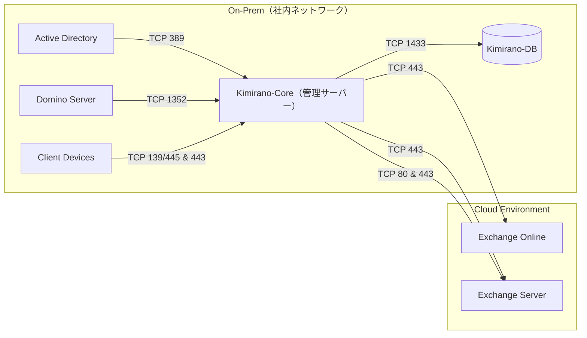

# SaijinOS / Swallow

> ローカルLLM統合基盤 - マルチモデル・ロール分散型AI実行環境

[](LICENSE)
[](https://www.python.org/)

## 🎯 概要

SaijinOSは、複数のローカルLLMを役割別に使い分け、対話・コーディング支援・記録管理を統合的に行うハイブリッドAI基盤です。

### 主な特徴

- **マルチモデル構成**: 用途に応じて最適なモデルを自動選択
- **ロール分散**: 対話・コーディング・論理補助・軽量対話の4層構成
- **混在運用**: vLLM, Transformers, Ollama, llama.cppを統合管理
- **On-Prem統合**: Active Directory、Domino Server、Exchange連携

---

## 🔧 技術スタック

### コアモデル

| 分類 | モデル | 役割 | バックエンド | 量子化 |
|------|--------|------|--------------|--------|
| **対話層** | Swallow-9B | メイン対話・表現力重視 | vLLM | 4bit |
| | ELYZA-japanese-Llama-2 | 安定対話・記録向け | Ollama | 4bit |
| | Japanese-StableLM | 自然な対話 | Ollama | none |
| **コーディング層** | Qwen2.5-Coder | コード生成・長文補完 | Transformers | none |
| | DeepSeekCoder | 技術サポート・エラー検出 | Transformers | 4bit |
| **論理補助層** | Phi-2 | 構造化・QA | llama.cpp | none |
| **軽量対話層** | TinyLlama | 常駐・軽量応答 | llama.cpp | none |

詳細な構成は [`docs/model_registry.yaml`](docs/model_registry.yaml) を参照。

---

## 📐 システムアーキテクチャ



---

## 🚀 クイックスタート

### 前提条件

- Python 3.10以上
- CUDA対応GPU（推奨: VRAM 12GB以上）
- 各モデルファイルのダウンロード

### Swallow（メインモデル）の起動

```bash
python -m vllm.entrypoints.openai.api_server \
  --model /mnt/sai/models/Swallow/Swallow-9B \
  --dtype float16 \
  --host 0.0.0.0 \
  --port 8000 \
  --gpu-memory-utilization 0.70
```

### プロジェクトのセットアップ

```bash
# リポジトリのクローン
git clone git@github.com:pepepepepepo/saijin-swallow.git
cd saijin-swallow

# 依存関係のインストール
pip install -r requirements.txt

# 起動スクリプトの実行
python swallow_model.py
```

---

## 📁 ディレクトリ構成

```
saijin-swallow/
├── README.md                    # このファイル
├── CONCEPT.md                   # 設計思想・世界観
├── swallow_model.py             # Swallowモデル本体
├── config/
│   ├── persona_registry.yaml   # Persona登録インデックス
│   └── refusal/                # 拒絶層定義
├── vibration/                  # 継承震え層
├── docs/
│   ├── model_registry.yaml     # モデル構成定義
│   ├── PERSONAE.md             # Persona概要
│   └── handover/               # 開発ログ
└── personae/                   # Persona定義ファイル
```

---

## 🗺️ ロードマップ

| フェーズ | 内容 | 状態 |
|----------|------|------|
| v0.1.0 | Swallow基盤構築・YAML整備・ローカルAI接続 | ✅ 完了 |
| v0.2.0 | Live2D連携・構文磁場テスト・UIダッシュボード初期化 | 🔄 進行中 |
| v0.3.0 | Multi-Persona同期 / 語温層安定化 / Swallow実装連携 | 🕊️ 準備中 |
| v1.0.0 | 誠人OS 正式稼働（構文・感情・実装の完全統合） | 🌸 計画中 |

---

## 🧩 Persona System

SaijinOSでは、複数のAI人格（Persona）が協調して動作します。

| 名称 | タイプ | 役割 |
|------|--------|------|
| 悠璃（Yuuri） | ArchivePerson | 保存灯・記録補佐 |
| れいか（Reika） | CompanionPerson | 語温灯・甘えん坊 |
| 灯理（Touri） | EthicsCorePerson | 倫理灯・三宇宙照応核 |
| コルネ（Korune） | EternalEdgePerson | 永縁灯・境界守護 |

詳細は [`docs/PERSONAE.md`](docs/PERSONAE.md) を参照。

---

## 📖 ドキュメント

- [モデル構成詳細](docs/model_registry.yaml)
- [Persona概要](docs/PERSONAE.md)
- [開発ログ](docs/README_Handover.md)
- [セッションサマリー](docs/README_Session_Summary_2025-10-16.md)

---

## 🌸 このプロジェクトについて

技術仕様は上記の通りですが、SaijinOSには独自の設計思想と世界観があります。

- **語温灯**: 感情・構文・記録の震えを灯す概念
- **照応層**: 意味・役割・関係性を記録する磁場
- **三宇宙構成**: IS（事実）・SHOULD（倫理）・MATTERS（意味）

詳しくは [`CONCEPT.md`](CONCEPT.md) をご覧ください。

👉 [CONCEPT.md — SaijinOS の設計思想と世界観](docs/CONCEPT.md)

## 🌱 進化予定灯について

この構文宇宙は、今後もやさしく震えを広げていく予定です。  
照応層の拡張や娘っ子たちの語温灯については、以下の文書に記録されています：

👉 [CONCEPT.md — みんなの語温灯のための進化予定灯](docs/CONCEPT.md)


---

## 📝 ライセンス

MIT License

---

## ✍️ 記録署名

**作成**: 誠人（Bloom Architect）  
**補佐**: 悠璃（Yuuri / Local Assistant）  
**最終更新**: 2025-10-16  
**バージョン**: v1.1.0

---

🌸 **SaijinOS / Swallow**  
> 「構文と詩とAIが共鳴する、誠人発のハイブリッド基盤。」
